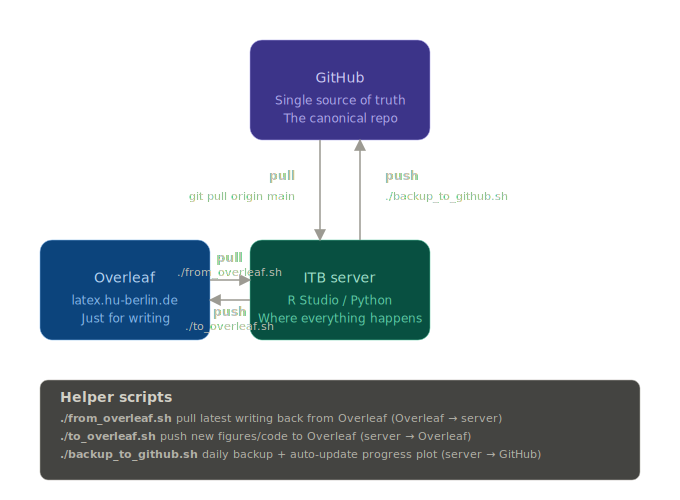

# Thesis writing workflow: Overleaf + server + GitHub

A tutorial for setting up a writing workflow for a thesis (or any LaTeX paper) using three tools:

- **GitHub** is the canonical repo. Everything important ends up there.
- **The ITB server** is where work happens: figures, code, analysis.
- **Overleaf** is just for writing LaTeX in the browser.



---

## Helper scripts at a glance

Three scripts handle the three sync directions:

| Script                          | What it does                                                | Direction                  |
| ------------------------------- | ----------------------------------------------------------- | -------------------------- |
| `./from_overleaf.sh`            | Pull the latest writing from Overleaf onto the server       | Overleaf, server          |
| `./to_overleaf.sh "msg"`        | Push new figures/code from the server to Overleaf           | server, Overleaf          |
| `./backup_to_github.sh "msg"`   | Commit + push the day's work to GitHub                      | server, GitHub            |

Plus three helpers that run automatically inside `backup_to_github.sh`:

| Script                | What it does                                                                            |
| --------------------- | --------------------------------------------------------------------------------------- |
| `track_progress.sh`   | Log today's page count of `main.pdf` to `progress.csv`                                  |
| `plot_progress.R`     | Regenerate `figures/progress.pdf` **and `figures/progress.png`** from the log           |
| `update_readme.sh`    | Refresh the README dashboard (progress block + chapters list) using `<!-- markers -->`  |

You don't run those yourself. Just run `./backup_to_github.sh` once a day and your README dashboard, page-count chart, and Git history all stay current.

---

## One-time setup

Three phases: Overleaf side, GitHub side, server side. Do them in order.

### A. Overleaf side

> **HU Overleaf instance**: [latex.hu-berlin.de](https://latex.hu-berlin.de). Log in with your HU account.
> If you've never used the HU Overleaf, see the official setup guide first: [HU Digital Learning, Overleaf (HDL3)](https://www.digitale-lehre.hu-berlin.de/en/hu-digital-learning-and-teaching-landscape-hdl3-1/overleaf/hdl3-overleaf).

1. Pick how to start your project:
   - **Use the bundled HU PhD template** (recommended).
     1. On the ITB server, zip the template:
        ```bash
        cd /groups/nils/resources/tutorial_overleaf_github/templates
        zip -r ~/phd-thesis.zip phd-thesis/
        ```
     2. Copy the zip from the server to your laptop (e.g. `scp server:~/phd-thesis.zip .`). Overleaf cannot reach the ITB server directly, so the upload always goes through your laptop.
     3. In Overleaf: `New Project, Upload Project`, select `phd-thesis.zip` from your laptop.
   - Or upload your own LaTeX project, or start from a blank Overleaf project.
2. Set `main.tex` as the main document. **Compile** to confirm it works.
3. Open `Menu, Git`. **Copy the URL**: `https://git.overleaf.com/<project-id>`.
4. Generate an Overleaf Git token: `Account Settings, Git Integration, Generate token`. Save it in your password manager. (Overleaf Git access requires a Premium / institutional plan.)

### B. GitHub side

1. **Set up an SSH key from the ITB server to GitHub first.** See [docs/03-authentication.md](docs/03-authentication.md). Without an SSH key, every `git push` will prompt for a password and fail (GitHub stopped accepting account passwords in 2021; only SSH keys or personal access tokens work).
2. Go to [github.com/new](https://github.com/new).
3. Name the repo (e.g. `thesis`).
4. **Private**.
5. **Leave everything else unchecked**: no README, no .gitignore, no license. The repo must be empty.
6. After creating, switch the page from `HTTPS` to `SSH` and copy the URL. It looks like `git@github.com:youruser/thesis.git` (note the `git@`, not `https://`). **Always use the SSH URL** in this tutorial; the HTTPS URL will trigger password prompts.

### C. Server side

SSH to the server, then:

```bash
# 1. Clone the Overleaf project. This is the only time you pull from Overleaf via clone;
#    after this, the server is the working copy.
cd ~                                       # or wherever you want your thesis directory
git clone <overleaf-url> thesis
cd thesis

# 2. Wire up the two remotes. The commands below are idempotent: they work whether
#    you cloned from Overleaf, cloned from GitHub, or ran `git init`. Use SSH for
#    GitHub (NOT https; https will prompt for a password and fail).
git remote rename origin overleaf 2>/dev/null || true   # rename only if origin exists
git remote add overleaf <overleaf-url> 2>/dev/null || git remote set-url overleaf <overleaf-url>
git remote add github   git@github.com:<youruser>/<repo-name>.git 2>/dev/null \
  || git remote set-url github git@github.com:<youruser>/<repo-name>.git
git remote -v                              # sanity check: github should start with git@github.com:

# 3. Copy the helper scripts, .gitignore, and thesis README template.
cp /groups/nils/resources/tutorial_overleaf_github/scripts/*.sh .
cp /groups/nils/resources/tutorial_overleaf_github/scripts/plot_progress.R .
cp /groups/nils/resources/tutorial_overleaf_github/templates/.gitignore .
cp /groups/nils/resources/tutorial_overleaf_github/templates/thesis-README.md README.md
chmod +x *.sh *.R

# 4. Create the project folders.
mkdir -p code figures

# 5. First push to GitHub. Branch name is 'master' (Overleaf clones come as master,
#    and the helper scripts use master throughout, so we match that everywhere).
git push -u github master
```

> **Branch name:** the whole workflow uses `master` because Overleaf forces `master`. Don't rename to `main` — it just creates a mismatch with the Overleaf remote.

### Sanity check

```bash
./from_overleaf.sh        # should say "Server is up to date with Overleaf."
git log --oneline -5      # you should see the Overleaf history
git remote -v             # both 'overleaf' and 'github' listed
```

If all three look right, setup is done.

---

## Daily routine

```
morning   ./from_overleaf.sh                          # pull last night's writing
work      Rscript code/<something>.R                  # generate figures, write code
mid-day   ./to_overleaf.sh "Add volcano plot"         # push figures to Overleaf
          (write in Overleaf)
          ./from_overleaf.sh                          # pull writing back to server
          (continue work)
end-day   ./backup_to_github.sh "Day's work: ch3"     # backup to GitHub + update progress chart
```

The simple rule: **edit `.tex` only in Overleaf, edit code/figures only on the server.** That way you can't get merge conflicts on the same file.

For more detail and a typical-day timeline, see [docs/02-daily-workflow.md](docs/02-daily-workflow.md).

---

## Folder structure (your thesis directory after setup)

```
thesis/
├── main.tex, chapters/, references.bib    (from the template)
├── figures/                               (script outputs, .pdf, .png)
├── code/                                  (R / Python scripts)
├── data/                                  (gitignored, never committed)
├── README.md                              (dashboard, auto-updated by update_readme.sh)
├── from_overleaf.sh
├── to_overleaf.sh
├── backup_to_github.sh
├── track_progress.sh
├── plot_progress.R
├── update_readme.sh
├── progress.csv                           (auto-generated by track_progress.sh)
└── .gitignore
```

---

## Prerequisites

- GitHub account ([github.com](https://github.com))
- SSH access to the ITB server
- An SSH key or personal-access-token configured for GitHub. See [docs/03-authentication.md](docs/03-authentication.md).
- Overleaf account on a Premium / institutional plan (Charité, HU). Git access is **not** available on free accounts.
- `pdfinfo` (poppler) and `Rscript` installed on the server, only needed for the progress chart.

---

## Detailed documentation

- [docs/01-setup.md](docs/01-setup.md): the same setup with extra detail and gotchas.
- [docs/02-daily-workflow.md](docs/02-daily-workflow.md): each script with examples.
- [docs/03-authentication.md](docs/03-authentication.md): SSH keys, GitHub PAT, Overleaf Git token.
- [docs/04-troubleshooting.md](docs/04-troubleshooting.md): merge conflicts, default branch, common errors.
- [docs/OnePager.md](docs/OnePager.md): printable one-page summary.

---

## Repo contents

- `scripts/`: the helper scripts.
- `templates/phd-thesis/`: bundled HU Berlin PhD thesis template (steinbrecht).
- `templates/.gitignore`: starter `.gitignore` for LaTeX + R + Python.
- `docs/`: detailed guides and the workflow diagram.

---

## Questions?

Open an issue on this repo or ask Rosario directly.

---

## Credits

- **LaTeX template**: the bundled [`templates/phd-thesis/`](templates/phd-thesis/) is the **HU Berlin PhD thesis template by steinbrecht**: [github.com/steinbrecht/template-phd-thesis](https://github.com/steinbrecht/template-phd-thesis). Used and redistributed unchanged. Please credit the original repository when you reuse the template.
- **Helper scripts and tutorial**: Rosario Astaburuaga-García.
